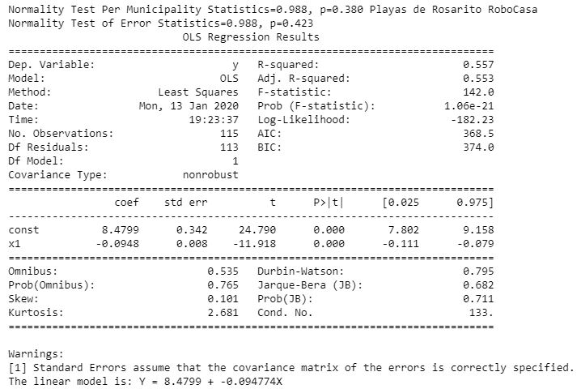
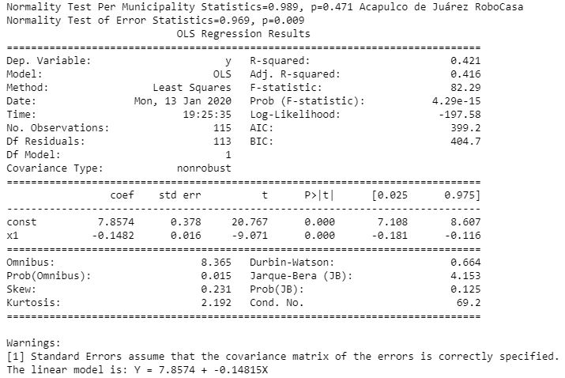
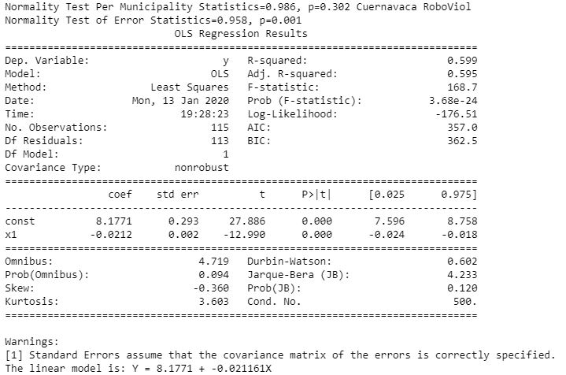

# Project-1
### Summary
This repository contains a Project regarding the relationship between the risk free rate and the [official database of Mexican Crimes](https://www.gob.mx/sesnsp/acciones-y-programas/datos-abiertos-de-incidencia-delictiva) from 2011 to 2019.
Four places had been identified in which certain crimes were significantly related to the Mexican risk free rate. 
For example: 
* Rs squared of House Robbery were 56% and 42% in Playas de Rosarito and Acapulco de Juarez, respectively;
* Rs squared of Violent Crime were 60% and 42% in Cuernavaca and Huimanguillo Tabasco, respectively; 
### Technical Details
In order to run the code, Jupyter Notebook and the following libraries are required: 
Sklearn, Scipy.stats, Statsmodels.sandbox.regression.predstd, Matplot and Pandas. 
### Screenshots
HouseRobberyInPlayasRosarito.JPG 
  
HouseRobberyInAcapulcoDeJuarez.JPGg 
  
ViolentCrimeInCuernavaca.JPG 
  
ViolentCrimeInHuimanguillo.JPG 
  
### Explanations 
The outcome is shown in screenshots for reference purpose of the public. 

# Project-1
From a database of multiple crimes around Mexico, it has been identified four places in which crimes can be predicted accurately. The linear regression models show values of certainty (R-squared) from 40 to 60 percent. 

## Comparison between Playas de Rosarito-House Robberies	if Y = 0 vs Actual Mean: 
b:8.4799	 
X:89.45042194	 
a:-0.0948	 
Y:0	 
Actual Mean (Crimes2011-2019): 41  
R squared: 56%  
* Conclusion: It can be concluded that 'House Robberies in Rosarito' are 54% away from crashing the Risk Free Rate Market (1 - 41/89).

## Comparison between Acapulco de Juarez-House Robberies	if Y = 0 vs Actual Mean: 
b:7.8574  
X:53.01889339  	
a:-0.1482	 
Y:0  
Actual Mean (Crimes2011-2019):22  
R squared: 42%  
* Conclusion: It can be concluded that 'House Robberies in Acapulco de Juarez' are 58% away from crashing the Risk Free Rate Market (1 - 22/53).

## Comparison between Cuernavaca-Violent Crime if Y = 0 vs Actual Mean: 
b:8.1771  
X:385.7122642	 
a:-0.0212	 
Y:0  
Actual Mean (Crimes2011-2019):168  
R squared:60%  
* Conclusion: It can be concluded that 'Violent Crimes in Cuernavaca' are 54% away from crashing the Risk Free Rate Market (1 - 168/385).

## Comparison between Huimanguillo Tabasco-Violent Crime	if Y = 0 vs Actual Mean: 
b:7.9277  
X:97.6317734  
a:-0.0812	 
Y:0  
Actual Mean (Crimes2011-2019): 41  
R squared:42%
* Conclusion: It can be concluded that 'Violent Crimes in Huimanguillo Tabasco' are 58% away from crashing the Risk Free Rate Market (1 - 41/97).
